## Bits and bytes to you! :black_cat:
Hi! I'm nekoze(he/him) and I'm software developer. I'm from Japan, living in Tokyo. 
You can reach me on [X](https://twitter.com/nekoze_da).

## Skills & Tools :paw_prints:

## Status :octocat:

  <a href="https://github.com/stats-organization/github-readme-stats-action">
    <picture>
      <source
        srcset="profile/stats-dark.svg"
        media="(prefers-color-scheme: dark)"
      />
      <source
        srcset="profile/stats-light.svg"
        media="(prefers-color-scheme: light), (prefers-color-scheme: no-preference)"
      />
      
    </picture>
  </a>
  <a href="https://github.com/stats-organization/github-readme-stats-action">
    <picture>
      <source
        srcset="profile/top-langs-dark.svg"
        media="(prefers-color-scheme: dark)"
      />
      <source
        srcset="profile/top-langs-light.svg"
        media="(prefers-color-scheme: light), (prefers-color-scheme: no-preference)"
      />
      
    </picture>
  </a>

